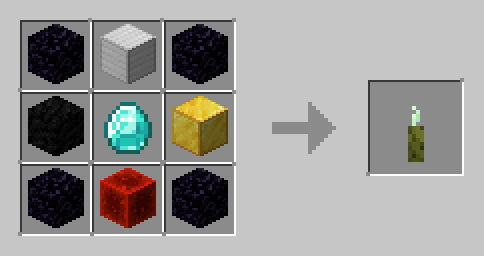

# Manhunt
Manhunt reprenant le concept de vidéos de Dream.

## Fonctionnalités
- Choix des speedrunners et des hunters : via la commande /config, une interface vous permet de sélectionner les joueurs ayant le rôle de hunter et de speedrunner
- Boussole : pointe vers un speedrunner, click droit pour changer de cible.
- Respawn d'un speedrunner : les speedrunners peuvent ressusciter un allié via un nouvel item

## Crédits

Merci à pika, zleh, zenox et wisyt pour avoir testé le plugin

Plugin développé par ziberty